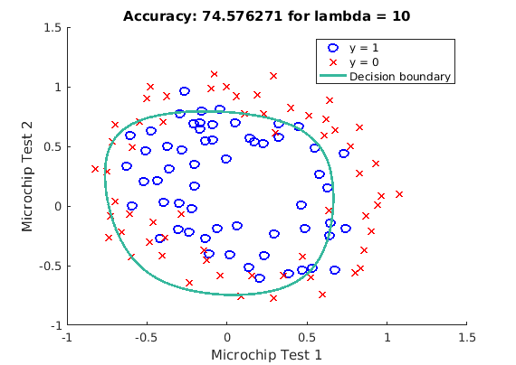

# [MachineLearning] 

## LogisticRegression

A regularized Classifier written in MATLAB/Octave

### Report

### Training Data

### Experiment with Regularization Parameter

###TODO
- ~~plotData.m - Function to plot 2D classification data~~  
- ~~sigmoid.m - Sigmoid Function~~  
- ~~costFunction.m - Logistic Regression Cost Function~~  
- ~~predict.m - Logistic Regression Prediction Function~~  
- ~~costFunctionReg.m - Regularized Logistic Regression Cost~~
- ~~Experiment with Regularization parameter~~
- Improve efficiency by reducing loops (sum)
- Update Graph output
- ~~Record results~~
- Remove Scafolding
- ~~Generate results Report~~
- ~~Make results gif~~